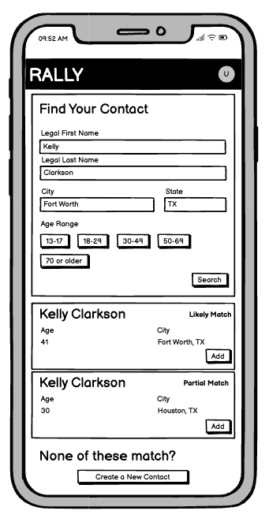

# Rally Front End Technical Assessment

This project is designed to assess your technical problem solving skills. For this project, we'll be looking at how you architect, build, and document front end components. We're not assessing your UI skills, so don't worry about styling. Also, we are not looking for you to write any unit tests.

This coding project shouldn't take longer than 2 hours. If you aren't finished in 2 hours, feel free to stop where you are at.

## The Problem

When Rally users join a campaign, they are prompted to add their friends and family as "contacts" so that the platform can direct users to action in their communities (e.g. "make a vote plan with your Aunt Susie"). As part of the process of adding their contacts, we ask users to search for them in the voter file, so we can have the most accurate information about contacts' registration status, voting history, and more. However, even if the user cannot find their contact in the voter file, we still want to add the contact to the system.

For this project, we are asking you to build a page that allows users to search the voter file using their contacts' first name, last name, city, and state. Any matches found by the search should then be displayed, with the ability for a user to then add that match as a contact. If no matches were found, or none of the matches are the right person, then the user should also be able to create a new contact record using the values from the form.

Matches should be displayed in the order of how well they match the search terms. Matches that match all of the search fields should be labelled with "likely match"; all other matches should be labelled as a "partial match".

After the contact has been successfully created, the user should be shown a dialog to indicate the contact was created (or if there was an error). After acknowledging the dialog, the form should reset back to a blank space so the user can search for another contact.

The following is a wireframe of the page we are asking you to build:

_Note_: The wireframe above includes an "Age Range" field, but that is outside the scope of the current project. Please leave that field out of the search form in your implementation.

## The Code

We are providing you with a boilerplate create-react-app template that includes TypeScript, React, and Material UI. Feel free to out any of the libraries if you prefer to use something else.

We have also added a `src/api.ts` file that provides functions for calling into a fake backend API. The API is implemented as functions that return a promise to the result of the "API" call.

- `searchVoterfile`: Takes search fields from the form (first name, last name, city, state) and attempts to find any matches in the voterfile. The data returned includes the voterfile information for any matches (including the `voterfileId`) along with a `score` that indicates how good of a match the user is.
- `createContactFromVoter`: Create a contact record from a voterfile ID.
- `createContactFromFields`: Create a contact record from first name, last name, city, and state values.
